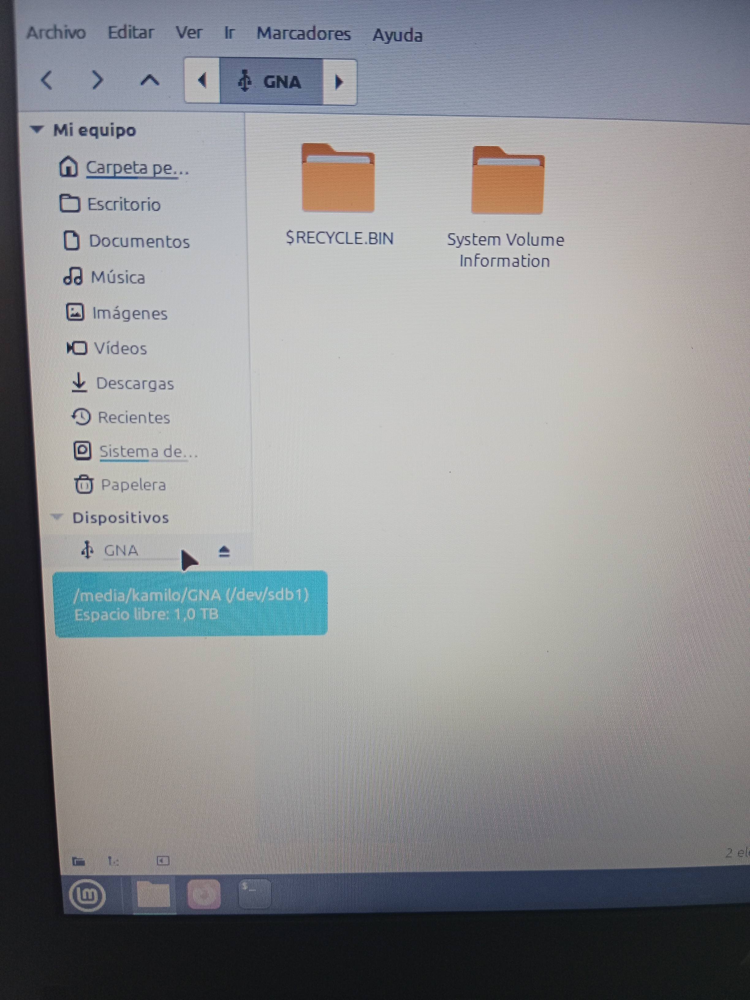
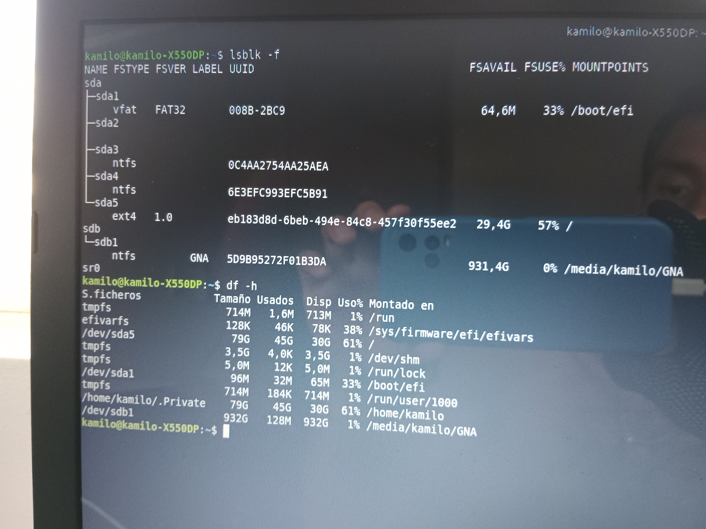
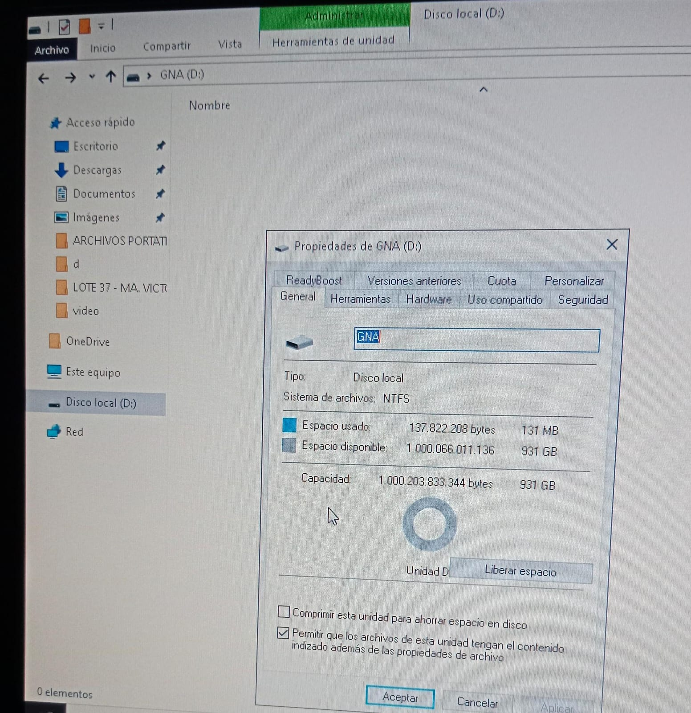

# Evidencias

## Objetivo

Esta sección recopila las evidencias finales del proyecto de recuperación del disco externo ADATA HD650.

Las imágenes muestran el resultado obtenido después de completar el diagnóstico, la reparación y la validación del disco, confirmando que volvió a funcionar correctamente tanto en Linux Mint como en Windows 10.

Más que documentar cada paso del proceso, estas evidencias representan el cumplimiento del objetivo principal del proyecto y sirven como un registro visual del resultado alcanzado.

---

## Evidencia 1 - Linux Mint

El disco fue reconocido y montado correctamente por Linux Mint.

**Imagen 1:** El disco es reconocido y montado correctamente por Linux Mint.

**Imagen 2:** Verificación del punto de montaje mediante el comando `df -h`.

---

## Evidencia 2 - Windows 10

Windows 10 reconoció correctamente el disco y permitió acceder a la unidad.

